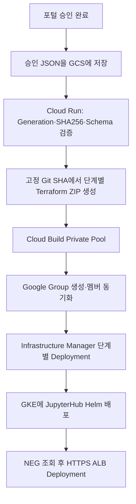

# 기존 환경 추가형 Sandbox 자동화 설계

## 관리 경계

| 영역 | 실행 주체 | 프로젝트 | 소스 | 실행 시점 |
|---|---|---|---|---|
| 기존 Shared VPC 기준 자원 | Shared VPC 관리자 | `pjt-d-shared-base` | `terraform/00-network-host` | 별도 승인된 네트워크 변경 때만 |
| Shared VPC 런타임 IAM | Shared VPC 관리자 | `pjt-d-shared-base` | `terraform/00-admin/iam` | 서비스 프로젝트 런타임 연결 변경 때만 |
| Foundation 실행 | `instance-son`의 Foundation 실행 계정 | `prj-b-cicd-local-236d`, `pjt-d-host01` | `terraform/01-foundation` | 최초 구성 또는 공통 변경 때만 |
| Google Group | Workspace 위임 계정 | Google Workspace | `scripts/group_upsert.py` | 승인 과제마다, GCP 자원보다 먼저 |
| 과제 프로젝트 | Infrastructure Manager Project Factory SA | 승인 JSON의 신규 프로젝트 | `deployments/10-project` | 승인 과제마다 |
| 과제 네트워크 | Infrastructure Manager Network Admin SA | `pjt-d-shared-base` | `deployments/20-network` | `network.required=true`일 때만 |
| 과제 IAM | Infrastructure Manager Project IAM SA | 신규 과제 프로젝트 | `deployments/30-project-iam` | 승인 과제마다 |
| BigQuery·GCS·Jupyter GSA | Infrastructure Manager Data Admin SA | 신규 과제 프로젝트 | `deployments/40-data` | 승인 과제마다 |
| Namespace·KSA·RBAC | Infrastructure Manager GKE Admin SA | `pjt-d-host01` | `deployments/50-gke-jupyter` | 승인 과제마다 |
| JupyterHub | GKE Admin SA를 제한적으로 가장한 Cloud Build | `pjt-d-host01` | Helm OCI Chart | 승인 과제마다 |
| External HTTPS ALB | Infrastructure Manager LB Admin SA | `pjt-d-host01` | `deployments/60-loadbalancer` | Jupyter NEG 생성 후 |

## 자동 실행 경로



포털 승인 이후에는 추가 수동 승인을 넣지 않습니다. 실패하면 같은 승인 요청을 재호출할 수 있으며 Cloud Run의 `dispatch.json` 잠금이 동일 요청의 중복 Build를 방지합니다.

## 승인 JSON의 역할

승인 JSON은 변경 불가능한 실행 계약입니다. 포털은 다음 네 값을 Cloud Run에 전달합니다.

| 값 | 의미 |
|---|---|
| `request_id` | 승인 요청의 고유 ID |
| `approved_json_uri` | 제한된 요청 버킷의 GCS URI |
| `generation` | 승인 당시 GCS Object Generation |
| `sha256` | 승인 JSON 원문의 SHA256 |

Cloud Run은 `task.name`, Group 주소, GKE Namespace, `/24` Subnet 이름과 CIDR의 상호 일치도 검사합니다. `source.commit_sha`는 반드시 배포가 승인된 Git Commit의 40자리 SHA여야 합니다.

## Infrastructure Manager State

각 Root Module은 별도 Deployment입니다. Root Module에 `backend` 블록을 두지 않으며 Infrastructure Manager가 State와 Revision을 관리합니다.

| Deployment 이름 예 | 소유 State |
|---|---|
| `im-sbx01-project` | 프로젝트, Billing, API, 후속 실행 SA bootstrap IAM |
| `im-sbx01-network` | 선택적 `/24` Subnet, Shared VPC Service Project Join |
| `im-sbx01-iam` | 과제 Group의 프로젝트 IAM |
| `im-sbx01-data` | BigQuery, GCS, Jupyter GSA와 Workload Identity |
| `im-sbx01-gke-access` | Namespace, ResourceQuota, KSA, RBAC |
| `im-sbx01-lb` | Cloud Armor, Health Check, Backend, 인증서, IP, HTTPS Forwarding Rule |

## 기존 Terraform State 보호

`terraform/00-network-host`와 `terraform/01-foundation`은 이미 적용된 State가 있으므로 이번 변경에서 디렉터리를 물리적으로 나누지 않습니다. 파일을 새 Root로 단순 이동하면 기존 자원을 삭제하고 재생성하는 Plan이 나올 수 있기 때문입니다.

- `00-network-host`는 기존 자원 주소를 유지하는 호환 Root이며 자동화에서 실행하지 않습니다.
- `01-foundation/migrations.tf`는 기존 두 Service Account의 State 주소만 안전하게 새 `for_each` 주소로 이동합니다.
- 향후 `network-host`, `IAM`, `state-gcs`, `foundation-sbx`, `foundation-2comm`을 별도 State로 나눌 때는 먼저 `terraform state mv`/import 계획과 각 Root의 Backend Prefix를 승인해야 합니다.
- 어떤 Apply도 먼저 `terraform show -no-color PLAN`에서 삭제·교체 항목을 검토해야 합니다.

## 최초 관리자 준비 사항

Foundation만으로 조직·Folder·Billing·Shared VPC 권한을 스스로 획득하지 않습니다. 최상위 관리자는 다음 권한을 해당 전용 SA에 사전 부여합니다.

| 실행 SA | 필요한 관리 범위 |
|---|---|
| `sa-im-project-factory` | 승인 Sandbox Folder의 Project Creator, Billing Account User, 생성 프로젝트의 IAM bootstrap 가능 권한 |
| `sa-im-network-admin` | `pjt-d-shared-base`의 승인 범위 Network Admin 및 XPN Admin |
| `sa-im-project-iam` | 10-project가 신규 프로젝트에 bootstrap한 Project IAM Admin |
| `sa-im-data-admin` | 10-project가 신규 프로젝트에 bootstrap한 BigQuery·Storage·Service Account 권한 |
| `sa-im-gke-admin` | `pjt-d-host01`의 GKE 관리 권한 |
| `sa-im-lb-admin` | `pjt-d-host01`의 Load Balancer·NEG 조회 권한 |
| `sa-sandbox-group-admin` | Workspace Admin Console에서 Domain-wide Delegation 승인 |

Cloud Run 호출은 과제 사용자 Group이 아니라 `sa-sandbox-portal`만 허용합니다. 실제 포털 런타임 주체에는 이 SA를 가장할 수 있는 최소 권한을 별도로 부여합니다.

## 인터넷이 없는 Private Pool

Private Pool 실행 중에는 `pip install`이나 공개 Helm Chart 다운로드를 하지 않습니다. Foundation이 인터넷 접근 가능한 기본 Cloud Build에서 다음 이미지를 미리 만들어 Artifact Registry에 저장합니다.

```text
sandbox-automation-runner:latest
```

이 이미지에는 `gcloud`, Helm, Google Admin SDK Python Client가 포함됩니다. JupyterHub Chart도 Foundation 변수의 사내 Artifact Registry OCI 주소에 미리 미러링해야 합니다.

## 현재 제한

- JSON Schema는 `CREATE`만 허용합니다.
- 삭제는 데이터 보존, Shared VPC 분리, 프로젝트 삭제, Group 처리 순서를 가진 별도 승인 Workflow로 구현해야 합니다.
- Public DNS Zone 정보는 현재 승인 JSON에 없으므로 ALB Global IP 생성까지 자동화하고 DNS A Record 등록은 별도 DNS 관리 절차가 담당합니다.
