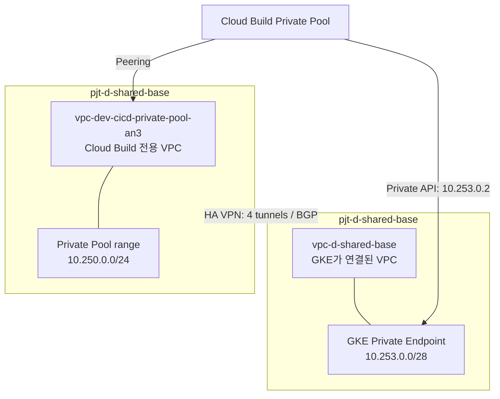

# Cloud Build Private Pool → Private GKE API 경로

## 목적

Cloud Build Private Pool에서 Main GKE `gke-sbx-main-an3`의 Private Endpoint
`10.253.0.2`에 사설 경로로 연결한다.

Cloud Build Pool과 GKE control plane은 모두 Google 관리 네트워크에서 고객 VPC로
연결된다. VPC Peering은 전이 라우팅을 지원하지 않으므로 기존 단일
`vpc-d-shared-base`만으로는 Pool에서 control plane에 도달할 수 없다.

이 설계는 Google의 Cloud VPN 기반 권장 토폴로지를 따른다.

## 목표 토폴로지

두 VPC는 같은 Host Project에 두되, 서로 다른 VPC로 분리한다.

| 항목 | 값 |
|---|---|
| GKE VPC | `vpc-d-shared-base` |
| GKE control-plane CIDR | `10.253.0.0/28` |
| Pool 전용 VPC | `vpc-dev-cicd-private-pool-an3` |
| Pool peering range | `10.250.0.0/24` |
| 리전 | `asia-northeast3` |
| HA VPN | 양 VPC에 HA VPN Gateway 1개씩 |
| BGP | Cloud Router 2개, 터널 4개, 세션 4개 |
| GKE MAN | `10.250.0.0/24` 유지 |

## Terraform 변경 단위

`terraform/00-network-host`가 다음 항목을 관리한다.

1. Pool 전용 custom-mode VPC
2. Pool 전용 VPC의 `10.250.0.0/24` global VPC peering range 및 Service Networking 연결
3. 양 VPC의 HA VPN Gateway, Cloud Router, 4개 VPN 터널과 BGP peer
4. BGP custom advertisement
   - Pool 측: `10.250.0.0/24`
   - GKE 측: `10.253.0.0/28`
5. Service Networking peering custom-route export
   - Pool VPC: GKE control-plane CIDR export
   - GKE VPC: Pool CIDR export

`terraform/01-foundation`은 Worker Pool의
`network_config.peered_network`를 Pool 전용 VPC self link로 전환한다.
`automation-runner`는 `privateEndpoint` 우선 연결을 그대로 유지한다.

## 안전한 적용 순서

이 변경은 Pool의 peered network 교체를 포함하므로 기존 Pool을 먼저 중지한다.

1. Git 최신 소스를 받고 Network 전용 Plan을 검토한다.
2. 기존 Worker Pool만 삭제한다. GKE/Cloud Run/Workflow는 삭제하지 않는다.
3. `00-network-host`에서 전용 VPC, PSA, VPN/BGP, route export를 적용한다.
4. BGP 세션이 4개 모두 `Established`인지 확인한다.
5. `01-foundation`을 적용하여 Worker Pool을 새 VPC에 재생성한다.
6. Private Pool에서 `kubectl get nodes` 사전 검증 Build를 성공시킨 뒤에만 Workflow 요청을 실행한다.

새 요청 ID를 사용한다. 실패한 `REQ-20260915-006`을 재시도하지 않는다.

## 적용 전 권한

이 토폴로지는 Shared VPC Host Project에서 다음 권한이 필요하다.

- `compute.networkAdmin`
- `compute.vpnAdmin`
- `compute.routerAdmin`
- `servicenetworking.services.addPeering`
- private-pool 재생성 권한

일반 Foundation 실행 계정의 권한이 부족하면, 관리자 IAM Bootstrap으로 필요한 최소 권한을
먼저 Git Terraform에 정의하고 `admin@sonmap.net`으로 그 IAM Root만 적용한다.

## 비용 중지

비용 중지 시 아래 순서를 지킨다.

1. Worker Pool
2. VPN tunnels
3. Cloud Routers
4. HA VPN gateways
5. Pool VPC Service Networking connection 및 reserved range
6. Pool 전용 VPC

기존 `vpc-d-shared-base`, GKE, 기존 Sandbox Project/Data에는 영향을 주지 않는다.
